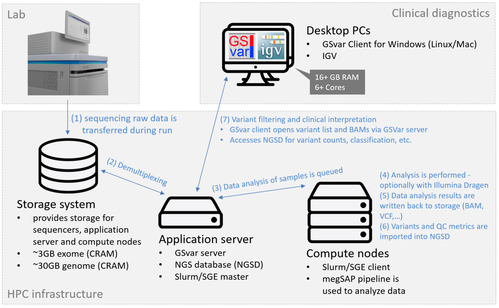
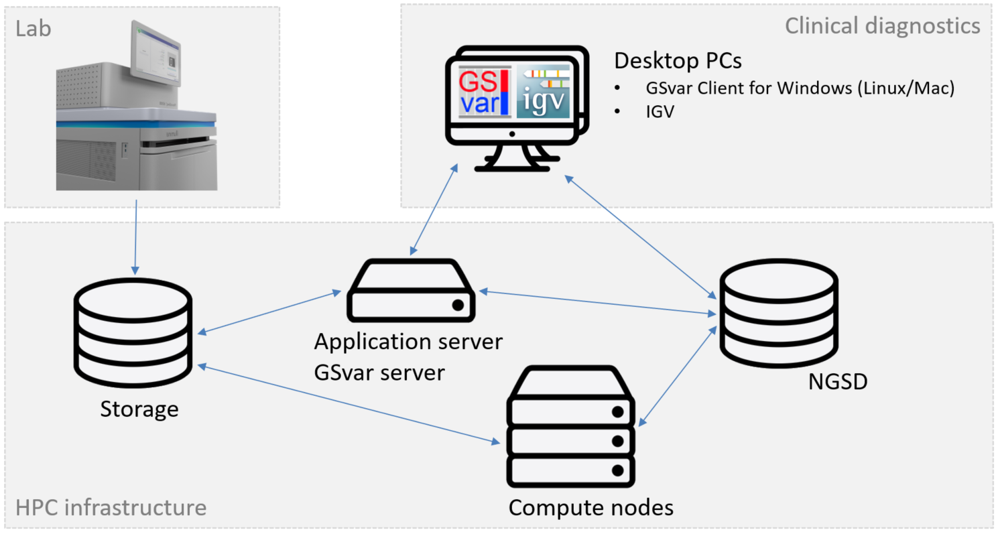

# The megSAP/GSvar software stack

## Which software components are there?

Our sofware consists of serveral components, which play together to allow efficient diagnostics in the domain of rare disease and oncology:

**megSAP:**  
A open-source NGS analysis pipeline designed specifically for medical genetics, which is developed by the Institute of Medical Genetics and Applied Genomics, University Hospital, Tübingen. megSAP is developed since 2016 and is freely available at <https://github.com/imgag/megSAP/>.

**GSvar:**  
A graphical decision support system for rare disease and oncological applications. It allows biologists and physicians to interpret genetic variants detected by megSAP in the context of a patientient's disease. GSvar is developed since 2014 and is freely available as part of *ngs-bits*: <https://github.com/imgag/ngs-bits/>

**NGSD:**  
NGSD is the central database behind GSvar, which contains variants, QC metrics and all manually curated data of analyzed samples.

## Why megSAP/GSvar?

Our complete software stack is free and open-source, so you can do things you cannot do with closed systems:

- Unrestricted access to all files of all samples, e.g. for research
- Unrestricted access to all databases content (variants, QC values, diagnostics data), e.g. for research or publications
- Freedom to install our software are you like (on-premise, on external rented servers, on AWS infrastructure)
- The possibility to adapt megSAP/GSvar yourself

It supports many technologies and use-cases:

- Illumina short-read sequencing
	- germline (panel, exome, genome)
	- somatic tumor-only (panel, exome, genome)
	- somatic tumor-normal (panel, exome, genome)
- ONT long-read genome sequencing
	- germline (genome)
- PacBio long-read genome sequencing
	- germline (genome)

## Overview

Here you find an overview of the software components with a simplyfied data journey:

 

This diagram shows the communication between components:

 

## Installation

You can find installation instructions for the components:

- megSAP: <https://github.com/imgag/megSAP/blob/master/doc/install_unix.md>
- NGSD: <https://github.com/imgag/ngs-bits/blob/master/doc/install_ngsd.md>
- GSvar client: <https://github.com/imgag/ngs-bits/blob/master/doc/install_unix.md#building-gsvar-optional>
- GSvar server: <https://github.com/imgag/ngs-bits/blob/master/doc/GSvarServer/index.md>
- IGV: <https://github.com/imgag/ngs-bits/blob/master/doc/GSvar/igv_integration.md>

## Support

If you want to use megSAP/GSvar in a clinical or commercial setting, you can get professional support from [dxOmics](https://www.dxomics.de/).
