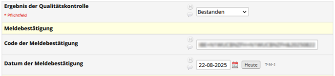

# Modellvorhaben Genomsequenzierung

## Projektübersicht

### Grundlagen

Das Institut für Medizinische Genetik und Angewandte Genomik (IMGAG) führt den Datenexport für das Modellvorhaben durch 

- für KDK-Daten des SE Netzwerks (KDK-Export für OE wird vom ZPM gemacht)
- für GRZ-Daten aller Netzwerke

Voraussetzungen/Zuständigkeiten:

- Modellvorhaben-Fall abgeschlossen/abgebrochen
- Documentation abgeschlossen in:
  - RedCap `Fallverwaltung Modellvorhaben Genomsequenzierung` für SE (ZSE) und OE (ZPM)
  - RedCap `Netzwerk Seltene Erkankungen` für SE (ZSE)
  - NGSD (NGS-Datenbank IMGAG)

### Schritt 1 – Datenaggregation + Prüfung

Um den Datenexport durchzuführen wurde die Applikation MVHub entwickelt:

MVHub ermöglicht einen Gesamtübersicht aller Daten zu den Fällen im Modellvorhaben.
Dazu werden für jeden Fall die Daten aus folgenden Quellen in einem Datenbank-Backend von MVHub gesammelt:

- Daten aus RedCap `Fallverwaltung Modellvorhaben Genomsequenzierung` via XML-Export
- Daten aus RedCap `Netzwerk Seltene Erkankungen` via XML-Export
- Proben-IDs der Genetik aus NGSD (NGS-Datenbank IMGAG)
- Einwilligung Forschung (REST API des meDIC für Broad Consent)

Die primäre Datenquelle ist dabei das RedCap der Fallverwaltung.
Alle anderen Daten werden über die Patienten-ID von SAP mit den Daten der Fallverwaltung zusammengeführt.

Vor dem Datenexport muss geprüft werden ob die Daten bereit sind für den Upload:

- Fall abgeschlossen oder abgebrochen
- Grobe Prüfung der Daten (alles vorhanden, keine Wiedersprüche)

### Schritt 2 - Upload

Nach positiver Prüfung eines Datensatzes kann aus MVHub der Upload der Daten angestoßen werden.  
Dazu wird der Auftrag zum Export an KDK/GRZ in der MVHub-Datenbank hinterlegt.

Auf dem IMGAG Applikationsserver läuft ein Background-Prozess der den eigentlichen Export durchführt. Das Ergebnis jedes Exports (erfolgreich/abgebrochen und Ausgabe auf stdout/stderr) werden in der Datenbank gespeichert (siehe Screenshot). Falls ein Upload nicht erfolgreich ist, kann er nach Korrektur der Metadaten wiederholt werden.

Für jeden Upload wird eine TAN über das Trustcenter des meDIC generiert.

### Schritt 3 - Meldebestätigung

Nach erfolgreichem Upload, wird im RedCap „ Fallverwaltung” die Information zum Upload hinterlegt (Datum, TAN, …):

Nach Prüfung der hochgeladenen Daten schickt das KDK/GRZ einen Prüfbericht ans BfArM.
Das BfArM schickt dann eine Meldebestätigung mit der TAN per Email an ein Funktionspostfach des UKT.

ZSE/ZPM dokumentieren die Meldebestätigung dann im RedCap und SAP:

## Installation of GRZ QC workflow (not used right now because of the Nextflow problems

### Installation nexflow

	> cd /mnt/storage2/MVH/tools/nextflow
	> curl -s https://get.nextflow.io | bash

### Installation of nf-core tools

	> pipx install nf-core

### Installation of GRZ QC pipeline

	> export PATH=$PATH:/mnt/storage2/MVH/tools/nextflow/
	> nf-core pipelines download BfArM-MVH/GRZ_QC_Workflow --container-system singularity
	> nextflow plugin install nf-schema@2.1.1

## Installation of tools (for running this script without GRZ QC workflow)

### Installation of mosdepth

	> wget https://github.com/brentp/mosdepth/releases/download/v0.3.11/mosdepth --no-check-certificate

### Installation of fastp

	> wget http://opengene.org/fastp/fastp
	> chmod a+x ./fastp

### Installation of fastplong

	> wget http://opengene.org/fastplong/fastplong
	> chmod a+x ./fastplong

## Installation of GRZ-CLI

see <https://github.com/BfArM-MVH/grz-tools/blob/main/packages/grz-cli/README.md> for details

Install miniforge at /mnt/storage2/megSAP/tools/miniforge3/

	> curl -L -O "https://github.com/conda-forge/miniforge/releases/latest/download/Miniforge3-$(uname)-$(uname -m).sh"
	> bash Miniforge3-$(uname)-$(uname -m).sh

Install GRZ-CLI

	> /mnt/storage2/MVH/tools/miniforge3/bin/conda create -n grz-tools -c conda-forge -c bioconda "grz-cli"
	> /mnt/storage2/MVH/tools/miniforge3/bin/conda activate grz-tools

Updates with:

	> /mnt/storage2/MVH/tools/miniforge3/bin/conda update -n base -c conda-forge conda -c bioconda
	> /mnt/storage2/MVH/tools/miniforge3/bin/conda update -n grz-tools -c conda-forge -c bioconda grz-cli
	> cd /mnt/storage2/MVH/tools/GRZ_QC_Workflow && git pull

List all package versions:

	> /mnt/storage2/MVH/tools/miniforge3/bin/conda list -n grz-tools 

## Installation of python3

	> python3 -m venv /mnt/storage2/MVH/tools/python
	> /mnt/storage2/MVH/tools/python3/bin/pip install grz-pydantic-models pandas argparse importlib

## Installation of consent mapper

Install mapper (outside of UKT network):

	> git clone https://github.com/KohlbacherLab/mii_broad_consent_mapper.git
	> ./gradlew build 

Note: now a JAR is available as well: https://github.com/orgs/KohlbacherLab/packages?repo_name=mii_broad_consent_mapper
